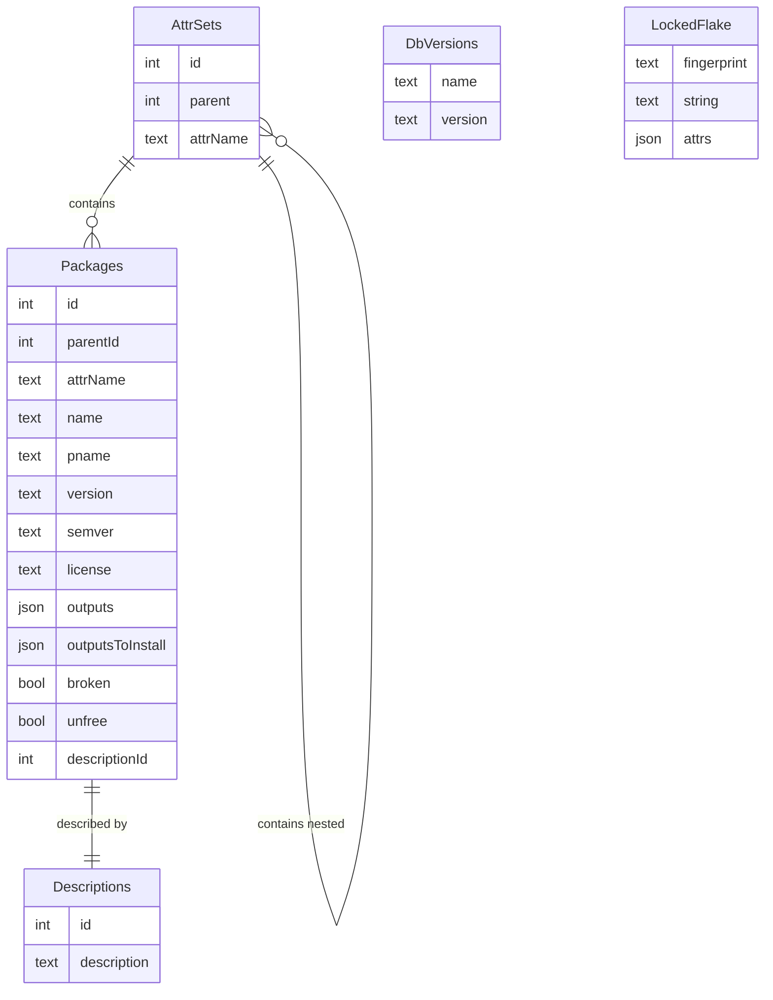

# Flox Package Database

CRUD operations on `nix` package metadata.

[Documentation](https://flox.github.io/pkgdb/index.html)

### Purpose

Evaluating nix expressions for an entire flake is expensive but necessary for features like package search. This tool provides a way to scrape the data from a flake once and store it in a database for later usage.

The current responsibility of the `pkgdb` tool extends only as far as scraping a flake and generating a database. The database should be queried using standard sqlite tools and libraries and all decisions about how and when to generate and update the database are left up to the consumer.

### Compilation

```bash
$ nix develop
$ make
```

### Usage

Build the database with the `scrape` subcommand:

```bash
$ pkgdb scrape github:NixOS/nixpkgs
fetching flake 'github:NixOS/nixpkgs'...
/Users/me/.cache/flox/pkgdb-v0/93a89abd052c90a33e8787a7740f2459cdb496980848011ae708b0de1bbfac82.sqlite
```

By default, packages will be scraped from packages.[system arch] and stored in `~/.cache` in a database named after the flake fingerprint. These can be overridden as desired:

```bash
$ pkgdb scrape github:NixOS/nixpkgs --database flakedb.sqlite legacyPackages aarch64-darwin
```

If the database for a given flake already exists and is asked to reprocess an existing package set, it will be skipped. Use `--force` to force an update/regeneration.

Once generated, the database can be opened and queried using `sqlite3`.

```bash
$ sqlite3 flakedb.sqlite 'SELECT name, version FROM Packages LIMIT 10'
[{"name":"AMB-plugins-0.8.1","version":"0.8.1"},
{"name":"ArchiSteamFarm-5.4.7.3","version":"5.4.7.3"},
{"name":"AusweisApp2-1.26.7","version":"1.26.7"},
{"name":"BeatSaberModManager-0.0.5","version":"0.0.5"},
{"name":"CHOWTapeModel-2.10.0","version":"2.10.0"},
{"name":"CertDump-unstable-2023-07-12","version":"unstable-2023-07-12"},
{"name":"ChowCentaur-1.4.0","version":"1.4.0"},
{"name":"ChowKick-1.1.1","version":"1.1.1"},
{"name":"ChowPhaser-1.1.1","version":"1.1.1"},
{"name":"CoinMP-1.8.4","version":"1.8.4"}]
```

### Schema

The data is represented in a tree format matching the attrPath structure.
The two entities are AttrSets (branches) and Packages (leaves). Packages and AttrSets each have a parentId, which is always found in AttrSets.

Descriptions are de-duplicated (for instance between two packages for separate architectures) by a Descriptions table.

`DbVersions` and `LockedFlake` tables store metadata about the version of `pkgdb` that generated the database and the flakes which have been scraped, respectively.



